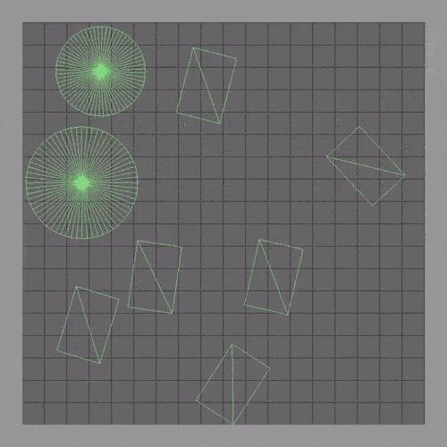

# Rigid body physics sim

Built on my [sdl game starter](https://github.com/NunoDasNeves/sdl-game-starter) repo.

## Build

### Windows

Install Visual Studio build tools
Install SDL 2.0.10 development libraries to C:\SDL2-2.0.10
Copy SDL2.dll to repo (it has to be in the same directory as the executable)

Run vcvarsall.bat to get compiler in the PATH.

Run build.bat.

### Linux

Install g++ and SDL2 with your package manager.

Run build.sh.
